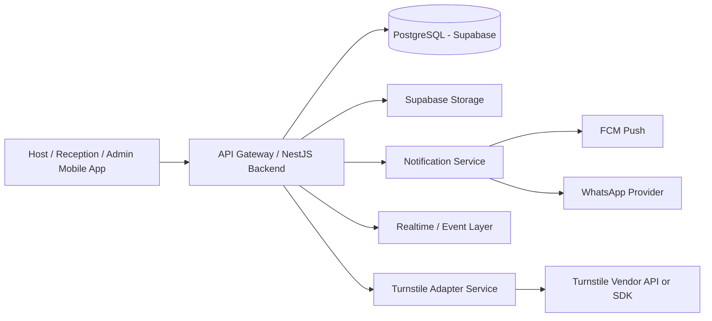
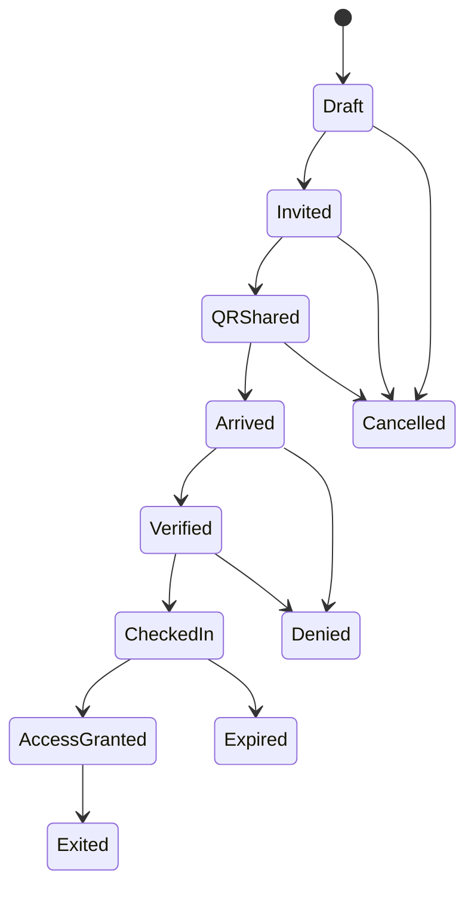
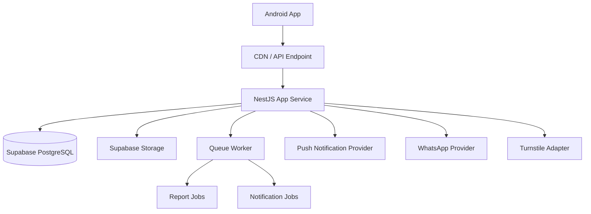

# Visitor Management System Architecture

## 1. Solution Summary

The Visitor Management System will be built as a role-based mobile-first platform for Android using React Native with Expo, backed by a Node.js API and Supabase PostgreSQL. The architecture supports a single tenant initially, but it is structured to scale across multiple sites and buildings from day one.

The system is optimized for:

- Low to moderate daily visitor volume
- Fast QR-driven lobby check-in
- Real-time host and admin visibility
- Future turnstile integration
- Strong auditability and privacy controls

## 2. Recommended Technology Stack

### Mobile

- React Native
- Expo
- TypeScript
- Expo Router for navigation
- Zustand or Redux Toolkit for state management
- React Query for server-state synchronization
- Expo Camera for QR scanning and live photo capture
- Expo Notifications for push notifications
- Expo SecureStore for secure token storage
- SQLite or MMKV for offline queue and local cache

### Backend

- Node.js
- NestJS
- TypeScript
- REST API for app and integration endpoints
- BullMQ or equivalent async job processor for reminders, report generation, and notification fan-out

Why NestJS:

- Strong modular architecture for auth, visits, reports, notifications, and integrations
- Clean controller-service-repository separation
- Good fit for TypeScript team growth
- Easier long-term maintainability than a loosely structured Express codebase

### Database And Storage

- Supabase PostgreSQL for transactional data
- Supabase Storage for visitor photos, if retained temporarily
- Redis recommended for queues, rate limits, and transient state if scale increases

### Notifications

- FCM for app push notifications
- WhatsApp Business integration for QR pass sharing

### Infrastructure

- Supabase managed backend services
- Backend API hosted on a Node-compatible platform such as Render, Railway, Fly.io, AWS ECS, or Azure App Service
- Production recommendation for stability: AWS ECS Fargate or Azure App Service

## 3. High-Level Component Architecture

## 4. Core Modules

### 4.1 Authentication And Authorization

- Password-based login
- Role-based access control
- Session timeout enforced at 2 hours
- Token-based auth with refresh flow
- Admin-configurable permission sets per role

Recommended enhancement:
- Add MFA for admin accounts, even if postponed for non-admin roles

### 4.2 Master Data

- Sites
- Buildings
- Floors
- Meeting rooms
- Visitor categories
- Purpose of visit
- Users and roles

### 4.3 Visit Management

- Pre-registered visits
- Bulk visitor invite support
- Walk-in visit creation by receptionist
- Reschedule, cancel, extend flows
- Duplicate visitor detection
- Visit status lifecycle

### 4.4 QR Pass Management

- Generate one QR per visit
- Use opaque signed token in QR instead of exposing raw PII
- Server validates QR state at scan time
- Invalidate QR after check-in

### 4.5 Reception Verification

- QR scan or manual search
- Camera-only live image capture
- Mandatory photo before check-in submit
- Manual ID verification and consent logging
- Auto-approve access after verification

### 4.6 Turnstile Integration

- Abstract vendor-specific logic behind an integration adapter
- Receive access grant request from verified visit workflow
- Return gate grant or denial status
- Persist integration request and response logs

### 4.7 Live Monitoring

- Active visitors
- Pending arrivals
- Checked-in visitors
- Denied entries
- Expired passes
- Gate or verification events

Recommended implementation:
- WebSocket or Supabase realtime subscriptions for instant updates

### 4.8 Reports And Analytics

- Operational reports from transactional database
- Scheduled export jobs
- CSV, Excel, PDF generation
- Audit-oriented activity logs for admin review

## 5. Proposed Visit Lifecycle

## 6. Offline-Resilient Design

Because poor network support is required, the mobile application should include:

- Local caching of recent visits and master data
- Deferred submission queue for:
  - Walk-in registrations
  - Photo upload metadata
  - Check-in events
- Sync retry with conflict handling
- Visual badge for pending sync items

Limitations:

- QR validation should still prefer online verification
- If offline fallback is allowed later, it should only accept cached same-day valid invite tokens with strict time checks

## 7. Security Architecture

### 7.1 Data Protection

- TLS for all network traffic
- At-rest encryption via managed infrastructure
- Application-level encryption for sensitive fields:
  - Mobile number
  - Email
  - ID number
  - Photo storage paths or metadata where needed

### 7.2 Privacy Controls

- Mask PII by default in UI
- Admin-only unmask permissions
- Consent capture before photo and ID verification
- Data retention jobs to purge photos after 1 month and visit data after 1 year if policy allows hard delete

### 7.3 Auditability

- Immutable audit log for create, update, scan, verify, approve, deny, cancel, and export events
- Include actor, role, timestamp, device, target entity, and before or after state summary

### 7.4 Operational Security

- Rate limiting on auth and QR validation endpoints
- Device session revocation
- Secure image upload via short-lived signed URLs
- Secrets stored outside source control

## 8. Recommended Deployment Architecture

## 9. Recommended MVP Scope

- Role-based Android app
- Host visitor pre-registration
- Bulk invite creation
- QR generation and WhatsApp sharing
- Reception scan, search, walk-in registration, and photo capture
- Auto-approval after reception verification
- Real-time arrival notifications for host and admin
- Monitoring dashboard inside app
- Core reports and exports
- Audit logs
- Turnstile adapter contract and one integration implementation if vendor details are confirmed

## 10. Phase 2 Recommendations

- iOS support
- Web dashboard for admin and security teams
- MFA for admin and host roles
- Watchlist and blacklist management
- OCR-assisted ID capture
- Face-match workflow
- Deeper gate analytics and emergency workflows
