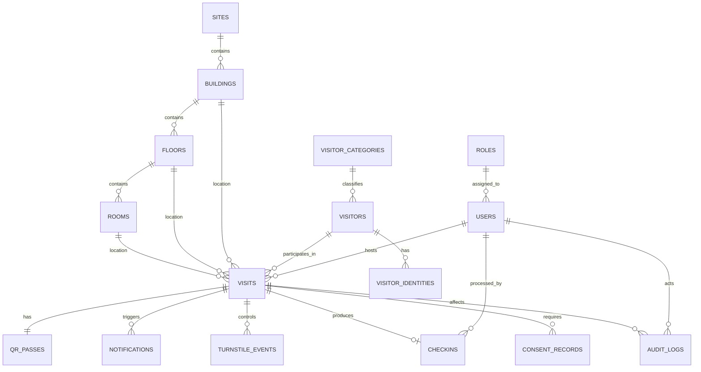

# Visitor Management System Database Design

## 1. Database Recommendation

PostgreSQL on Supabase is the recommended database because it provides:

- Strong relational integrity for visit, user, and building data
- Easy reporting with SQL
- Good support for indexing and filtering
- Managed backups and operational simplicity
- Straightforward future multi-site expansion

MongoDB is not preferred because the system has clear relational entities and reporting needs. MySQL would also work, but PostgreSQL offers better flexibility for JSON metadata, reporting, and row-level security if needed later.

## 2. Core Entities

- sites
- buildings
- floors
- rooms
- roles
- permissions
- users
- visitor_categories
- visitors
- visitor_identities
- visits
- visit_guests
- qr_passes
- checkins
- notifications
- audit_logs
- turnstile_events
- report_jobs
- consent_records

## 3. ER Diagram

## 4. Table Outline

### sites

- id UUID PK
- code VARCHAR unique
- name VARCHAR
- status VARCHAR
- created_at TIMESTAMP
- updated_at TIMESTAMP

### buildings

- id UUID PK
- site_id UUID FK -> sites.id
- code VARCHAR
- name VARCHAR
- created_at TIMESTAMP
- updated_at TIMESTAMP

### floors

- id UUID PK
- building_id UUID FK -> buildings.id
- name VARCHAR
- level_number INTEGER

### rooms

- id UUID PK
- floor_id UUID FK -> floors.id
- name VARCHAR
- room_code VARCHAR
- is_active BOOLEAN

### roles

- id UUID PK
- name VARCHAR unique
- description TEXT

### permissions

- id UUID PK
- key VARCHAR unique
- description TEXT

### role_permissions

- role_id UUID FK -> roles.id
- permission_id UUID FK -> permissions.id
- PK(role_id, permission_id)

### users

- id UUID PK
- role_id UUID FK -> roles.id
- employee_code VARCHAR nullable
- full_name VARCHAR
- email VARCHAR unique
- mobile_encrypted TEXT nullable
- password_hash TEXT
- site_id UUID nullable FK -> sites.id
- building_id UUID nullable FK -> buildings.id
- is_active BOOLEAN
- last_login_at TIMESTAMP nullable
- created_at TIMESTAMP
- updated_at TIMESTAMP

### visitor_categories

- id UUID PK
- name VARCHAR unique
- description TEXT nullable

### visitors

- id UUID PK
- category_id UUID FK -> visitor_categories.id
- full_name VARCHAR
- mobile_encrypted TEXT
- email_encrypted TEXT nullable
- company VARCHAR nullable
- created_at TIMESTAMP
- updated_at TIMESTAMP

### visitor_identities

- id UUID PK
- visitor_id UUID FK -> visitors.id
- id_type VARCHAR
- id_number_encrypted TEXT
- verified_by_user_id UUID nullable FK -> users.id
- verified_at TIMESTAMP nullable
- verification_status VARCHAR

### visits

- id UUID PK
- visitor_id UUID FK -> visitors.id
- host_user_id UUID FK -> users.id
- site_id UUID FK -> sites.id
- building_id UUID FK -> buildings.id
- floor_id UUID nullable FK -> floors.id
- room_id UUID nullable FK -> rooms.id
- purpose VARCHAR
- scheduled_start TIMESTAMP
- scheduled_end TIMESTAMP
- status VARCHAR
- source VARCHAR
- notes TEXT nullable
- created_by_user_id UUID FK -> users.id
- updated_by_user_id UUID FK -> users.id
- created_at TIMESTAMP
- updated_at TIMESTAMP
- cancelled_at TIMESTAMP nullable

### visit_guests

- id UUID PK
- visit_id UUID FK -> visits.id
- visitor_name VARCHAR
- mobile_encrypted TEXT nullable
- email_encrypted TEXT nullable

Use this table only if one host invite can create a grouped visit with sub-visitors. If each visitor always gets an independent visit record, this table can be omitted.

### qr_passes

- id UUID PK
- visit_id UUID unique FK -> visits.id
- qr_token_hash TEXT unique
- issued_at TIMESTAMP
- expires_at TIMESTAMP nullable
- consumed_at TIMESTAMP nullable
- status VARCHAR

### checkins

- id UUID PK
- visit_id UUID unique FK -> visits.id
- receptionist_user_id UUID FK -> users.id
- scan_time TIMESTAMP
- checkin_time TIMESTAMP
- exit_time TIMESTAMP nullable
- photo_storage_path TEXT nullable
- photo_retention_until TIMESTAMP nullable
- identity_verified BOOLEAN
- consent_captured BOOLEAN
- status VARCHAR

### notifications

- id UUID PK
- visit_id UUID nullable FK -> visits.id
- recipient_user_id UUID nullable FK -> users.id
- channel VARCHAR
- event_type VARCHAR
- payload_json JSONB
- status VARCHAR
- sent_at TIMESTAMP nullable
- delivered_at TIMESTAMP nullable

### turnstile_events

- id UUID PK
- visit_id UUID FK -> visits.id
- gate_code VARCHAR
- request_payload JSONB
- response_payload JSONB
- granted BOOLEAN
- event_time TIMESTAMP

### consent_records

- id UUID PK
- visit_id UUID FK -> visits.id
- consent_type VARCHAR
- consent_text_version VARCHAR
- accepted BOOLEAN
- accepted_at TIMESTAMP
- accepted_by_user_id UUID nullable FK -> users.id

### audit_logs

- id UUID PK
- actor_user_id UUID nullable FK -> users.id
- entity_type VARCHAR
- entity_id UUID
- action VARCHAR
- before_json JSONB nullable
- after_json JSONB nullable
- metadata_json JSONB nullable
- created_at TIMESTAMP

### report_jobs

- id UUID PK
- requested_by_user_id UUID FK -> users.id
- report_type VARCHAR
- filters_json JSONB
- export_format VARCHAR
- status VARCHAR
- file_path TEXT nullable
- created_at TIMESTAMP
- completed_at TIMESTAMP nullable

## 5. Key Relationships

- One site contains many buildings
- One building contains many floors
- One floor contains many rooms
- One role can belong to many users
- One visitor can have many visits
- One visit belongs to exactly one host
- One visit has one QR pass
- One visit has at most one check-in record in phase 1
- One visit can trigger many notifications and audit logs

## 6. Indexing Strategy

Create indexes for the most common lookup and reporting paths:

- users(email)
- visits(host_user_id, scheduled_start)
- visits(visitor_id, scheduled_start)
- visits(site_id, building_id, scheduled_start)
- visits(status, scheduled_start)
- qr_passes(qr_token_hash)
- checkins(checkin_time)
- notifications(recipient_user_id, status)
- audit_logs(entity_type, entity_id, created_at)
- turnstile_events(visit_id, event_time)

Suggested unique constraints:

- users.email
- roles.name
- visitor_categories.name
- qr_passes.visit_id
- qr_passes.qr_token_hash

## 7. Data Retention Rules

- Visitor photos: Delete after 30 days
- Visit data: Retain for 1 year
- Audit logs: Retain for 1 year
- Notification payloads: Keep only operational minimum if they contain sensitive data

## 8. Multi-Site Readiness

Although phase 1 has one tenant, all major operational tables should store site_id and building_id where relevant so future expansion does not require major schema redesign.
